# ⚡ Electric Vehicle Battery Model (EVBM) Optimization

This repository contains the simulation and optimization framework for modeling the electric vehicle (EV) charging cycle, home energy demand, solar generation, and bi-directional battery storage using Python. The workflow progresses from basic static models to refined, real-world optimization using control theory and weather-driven solar data.

---

## 🔍 Project Overview

The primary goal is to simulate and optimize energy flow in a smart residential system integrating:

- 🚗 **Electric Vehicle (EV)**
- 🔋 **Battery Storage System**
- ☀️ **Solar PV Array**
- 🏠 **Home Energy Demand**
- 🔌 **Grid/Utility Power**

---

## 🎯 Project Goals

- Simulate EV and battery SOC under various energy scenarios.
- Integrate real solar data via `pvLib`.
- Implement optimization using `cvxpy` to reduce grid dependency and costs.
- Analyze seasonal effects and energy use behavior.

---
## 📚 Table of Contents

- [📊 Control Volume Diagram](#-control-volume-diagram)
- [🔁 Iteration Timeline](#-iteration-timeline)
  - [🔹 Iteration 1: Basic Models](#-iteration-1-basic-models)
  - [🔹 Iteration 1.1: Utility and Constant Demand](#-iteration-11-utility-and-constant-demand)
  - [🔹 Iteration 1.2: Solar Integration](#-iteration-12-solar-integration)
  - [🔹 Iteration 1.3: Optimization Added](#-iteration-13-optimization-added)
  - [🔹 Iteration 1.4: Varying Demand](#-iteration-14-varying-demand)
- [⚙️ Iteration 2.0+: Advanced Modeling & Tuning](#️-iteration-20-advanced-modeling--tuning)
  - [🔹 Iteration 2.1: Refined Battery Models](#-iteration-21-refined-battery-models)
  - [🔹 Iteration 2.2: Objective Function Tuning](#-iteration-22-objective-function-tuning)
- [🧠 Technologies Used](#-technologies-used)
- [🚀 Getting Started](#-getting-started)
- [🧩 Class Descriptions](#-class-descriptions)
- [⚡ EVBM Optimization and Visualization Functions](#-evbm-optimization-and-visualization-functions)
  - [🧮 Function: `evbm_optimization_v2`](#-function-evbm_optimization_v2)
  - [📊 Function: `plot_results`](#-function-plot_results)
  - [📈 Function: `plot_obj_functions`](#-function-plot_obj_functions)
  - [🚀 Example Usage](#-example-usage)
---

## 📊 Control Volume Diagram

  
*Figure: Power flow between system elements—solar panels, EV, battery, grid, and home.*

---

## 🔁 Iteration Timeline

### 🔹 Iteration 1: Basic Models

- Static home demand and EV charging.
- Dynamic battery SOC modeled in Python.

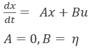  
*Figure: Power distribution under basic assumptions with constant demand and EV call.*

---

### 🔹 Iteration 1.1: Utility and Constant Demand

- Grid usage calculated as the gap between charger output and demand.
- SOC limits applied to EV and battery.

**Input Parameters:**

- Home Demand: 8.0 kW  
- EV Call: 5.0 kW  
- EV SOC Range: 0.5 – 0.9  
- Initial Battery SOC: 1.00  

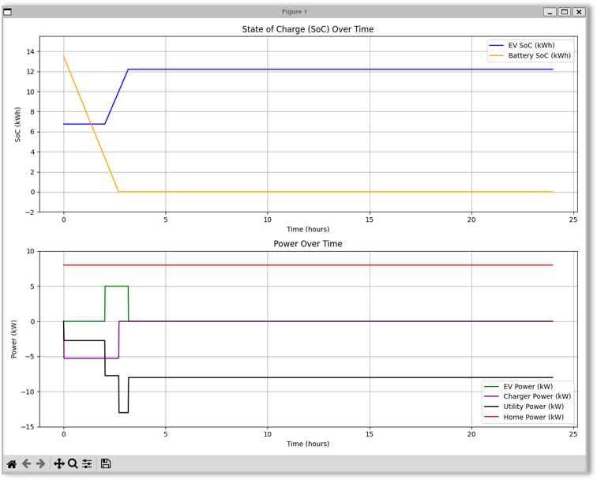  
*Figure: SOC and power dynamics with constant utility demand.*

---

### 🔹 Iteration 1.2: Solar Integration

- Solar modeled using `pvLib` and NOAA weather datasets.
- Seasonal simulations: Winter, Spring, Summer.

**Input Parameters:**

- Home Demand: 15.0 kW  
- Realistic solar generation using date-specific weather data.

**Seasonal Plots:**

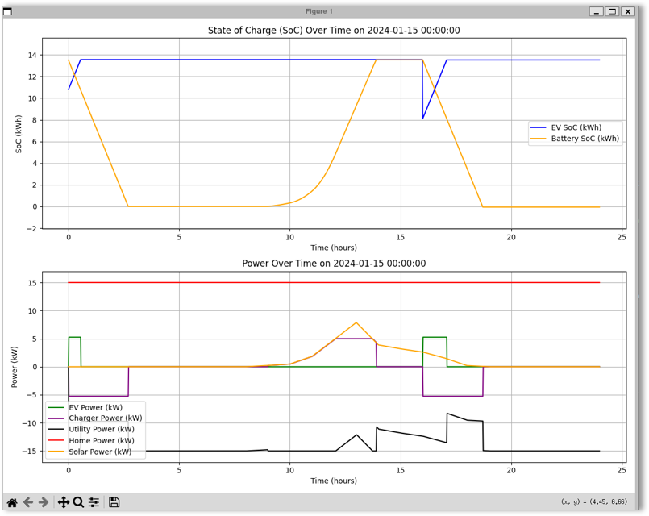  
*Figure: Winter simulation with low solar output.*

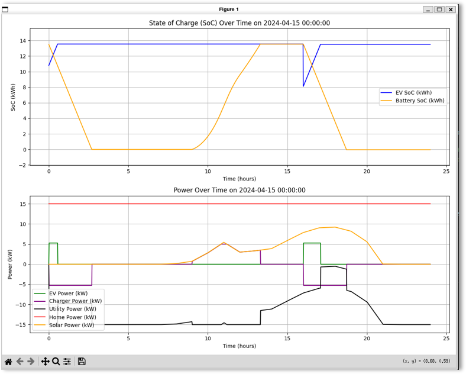  
*Figure: Spring simulation with moderate solar generation.*

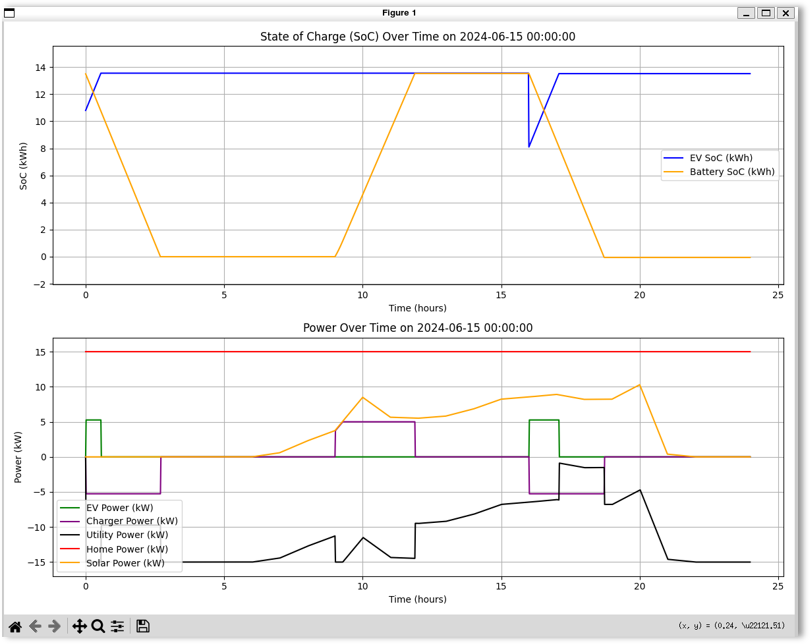  
*Figure: Summer simulation with peak solar availability.*

---

### 🔹 Iteration 1.3: Optimization Added

- Introduced convex optimization (`cvxpy`).
- Goal: Minimize utility power draw while satisfying EV and battery constraints.

**Control Variables:**  
- `P_bat` – Battery power  
- `P_ev` – EV power

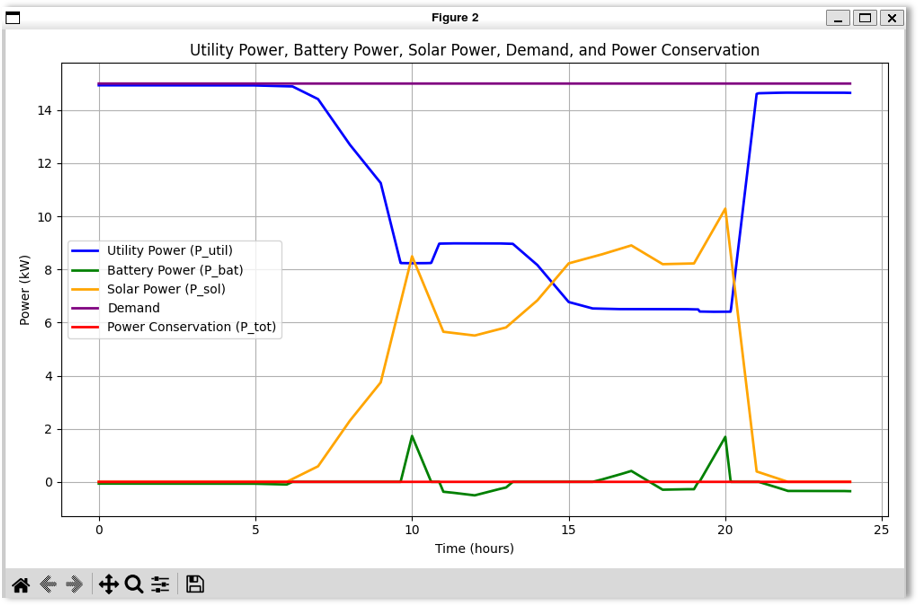  
*Figure: Optimized energy flows reducing utility dependency.*

---

### 🔹 Iteration 1.4: Varying Demand

- Added temporal variations to home demand and solar output.
- Highlighted issues with excess grid feedback.

**Energy Flow Summary:**

- Grid Supplied: 31.13 kWh  
- Total Demand: 92.71 kWh  
- Solar Generated: 91.70 kWh  
- Fed Back to Grid: 30.19 kWh  

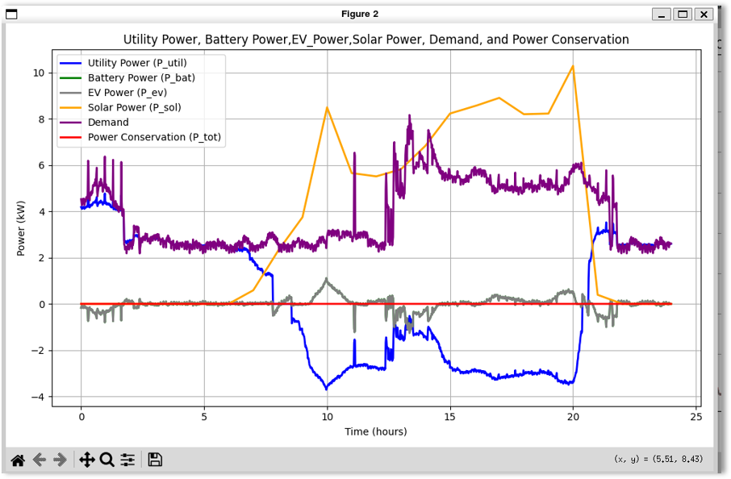  
*Figure: Overgeneration identified as key inefficiency.*

---

## ⚙️ Iteration 2.0+: Advanced Modeling & Tuning

### 🔹 Iteration 2.1: Refined Battery Models

- Tuned system matrices for battery behavior.
- Improved SOC curve predictions.

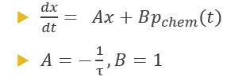  
*Figure: SOC tracking with improved battery model.*

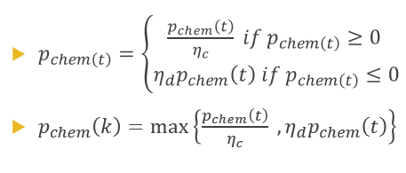  
*Figure: Battery charge/discharge efficiency refinement.*

---

### 🔹 Iteration 2.2: Objective Function Tuning

- Introduced time-of-use (ToU) cost factors.
- EV plug-in schedule modeled using departure/arrival windows.
- Soft constraints on SOC limits.

**Updated Energy Flow Summary:**

- Grid Supplied: 33.42 kWh  
- Solar Generated: 91.70 kWh  
- Feedback to Grid: 29.81 kWh  

**Graphs:**

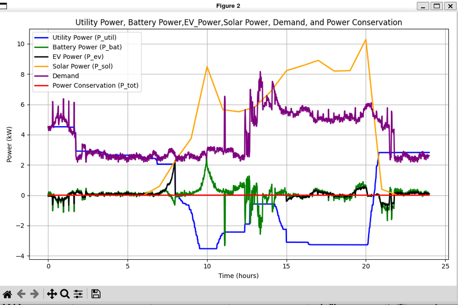  
*Figure: Smoothed power profile after tuning cost-sensitive objective.*

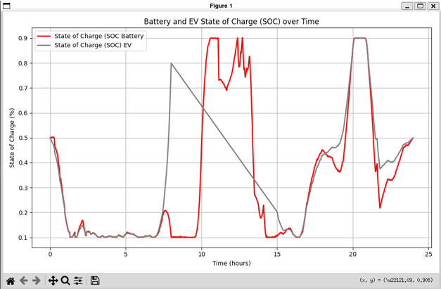  
*Figure: SOC evolution of EV and battery under optimized constraints.*

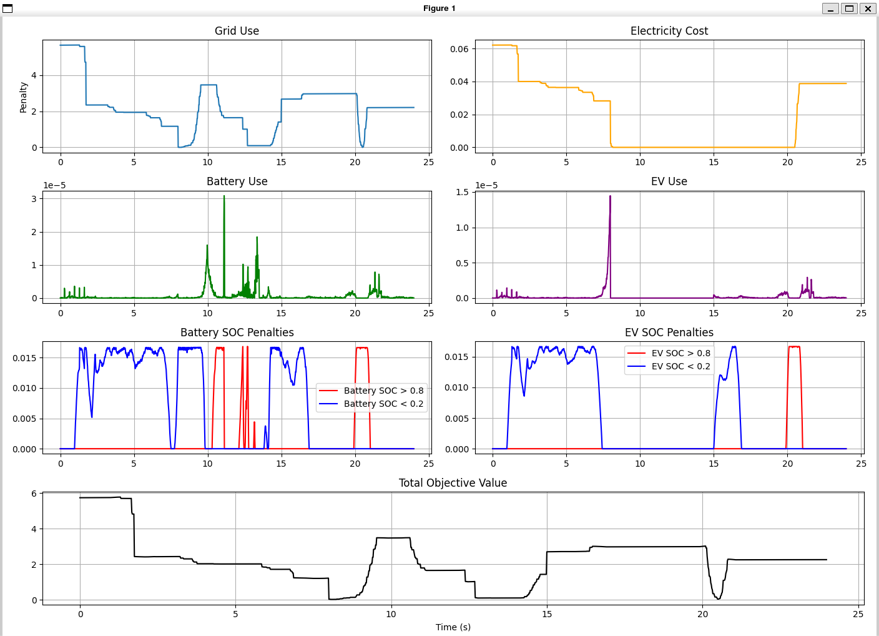  
*Figure: Visual validation of objective behavior.*

---

## 🧠 Technologies Used

- Python 3.x  
- [`cvxpy`](https://www.cvxpy.org/) – convex optimization  
- [`pvLib`](https://pvlib-python.readthedocs.io/) – solar power modeling  
- `numpy`, `pandas`, `matplotlib`

---

## 🚀 Getting Started

To run this project on your local machine:

### 1️⃣ Clone the Repository
```bash
git clone https://github.com/Purdue-DC-Nanogrid-House-Project/ev-battery-model.git
cd src
```

### 2️⃣ Set Up the Environment
```bash
conda env create -f requirements.yaml
conda activate evbm
```

### 3️⃣ Run the Optimization
Example using default test conditions:

```bash
cd src
python main.py
```

📌 Use --help with any script to see the available options:

---
## 🧩 Class Descriptions

### 🔋 BatteryModel
- Models the battery as a discrete-time linear system using state-space equations.
- Includes efficiency constraints, voltage and power rating, and time constant (`tau_b`).
- Provides both simple and refined dynamic SOC modeling.

### 🚗 EVModel
- Simulates the EV battery SOC using a similar state-space structure as the battery.
- Includes parameters for thermal effects, charging efficiency, departure/arrival times, and energy demand for travel.
- Tracks whether the EV is plugged in or out of the system.

### 🏠 HomeModel
- Loads real home demand data from a CSV file.
- Filters demand between specified start and end times.
- Converts demand to kW scale for integration with other components.

### ☀️ SolarPanelModel
- Uses `pvlib` to model PV generation for multiple rooftop panel segments.
- Each segment can have different tilt, azimuth, and capacity.
- Loads historical weather data for irradiance and temperature.
- Computes both DC and AC power output for the given day.

### ⚡ UtilityModel
- Simple wrapper for grid utility power interface.
- Used to track and apply external energy contributions or constraints.

### 🧠 Optimizer
- Central orchestrator for EV, battery, solar, utility, and home components.
- Stores initial states and simulation time horizon.
- Used to pass models and parameters into the optimization function.

---
## ⚡ EVBM Optimization and Visualization Functions 

This project includes three main functions to optimize and visualize energy management integrating battery and EV charging with solar power and home demand.

---

### 🧮 Function: `evbm_optimization_v2`

**🎯 Purpose:**  
Performs convex optimization to minimize grid energy costs and manage power flows among battery, EV, solar generation, home demand, and utility grid over a 24-hour horizon.

**📥 Inputs:**  
- `optimizer` object containing:  
  - `K` (int): Number of time steps  
  - `dt` (float): Time step size (hours)  
  - Battery and EV parameters (charging/discharging efficiencies, power limits, system dynamics)  
  - Solar power profile (`solar_model.dc_power_total`)  
  - Home demand profile (`home_model.demand`)  
  - Initial SOC values: `x0_b` (battery), `x0_ev` (EV)  
  - EV arrival (`time_arrive`) and leave (`time_leave`) times  

**📤 Outputs:**  
- `x_b.value`: Battery SOC over time `(1, K+1)`  
- `x_ev.value`: EV SOC over time `(1, K+1)`  
- `P_bat.value`: Battery power profile `(K, 1)`  
- `P_ev.value`: EV power profile `(K, 1)`  
- `P_util.value`: Grid power profile `(K, 1)`  
- `P_sol`: Interpolated solar power `(K, 1)`  
- `P_dem`: Home demand profile `(K, 1)`  

---

### 📊 Function: `plot_results`

**🎯 Purpose:**  
Visualizes optimization results, including SOC curves, power flows, and energy flow summaries.

**📥 Inputs:**  
- Battery and EV SOC arrays: `x_b`, `x_ev`  
- Battery and EV power arrays: `P_bat`, `P_ev`  
- Grid power array: `P_util`  
- Solar power array: `P_sol`  
- Home demand array: `P_dem`  
- Time step size: `dt` (hours)  

**📤 Outputs:**  
- Plots showing SOC and power profiles over time  
- Console summary of energy flows (kWh):  
  - Grid supply to home and battery  
  - Total home demand  
  - Solar energy produced  
  - Energy fed back to grid  

---

### 📈 Function: `plot_obj_functions`

**🎯 Purpose:**  
Decomposes and visualizes components of the optimization objective function to analyze grid use, battery and EV use, electricity costs, and SOC penalties.

**📥 Inputs:**  
- Battery and EV SOC arrays: `x_b`, `x_ev`  
- Battery and EV power arrays: `P_bat`, `P_ev`  
- Grid power array: `P_util`  
- Solar power array: `P_sol`  
- Home demand array: `P_dem`  
- Time step size: `dt` (hours)  

**📤 Outputs:**  
- Multi-panel plots of:  
  - Grid use penalty  
  - Electricity cost penalty  
  - Battery use penalty  
  - EV use penalty  
  - Battery SOC penalty (high/low)  
  - EV SOC penalty (high/low)  
  - Total objective value over time  

---

### 🚀 Example Usage

```python
x_b, x_ev, P_bat, P_ev, P_util, P_sol, P_dem = evbm_optimization_v2(optimizer)
plot_results(x_b, x_ev, P_bat, P_ev, P_util, P_sol, P_dem, optimizer.dt)
plot_obj_functions(x_b, x_ev, P_bat, P_ev, P_util, P_sol, P_dem, optimizer.dt)